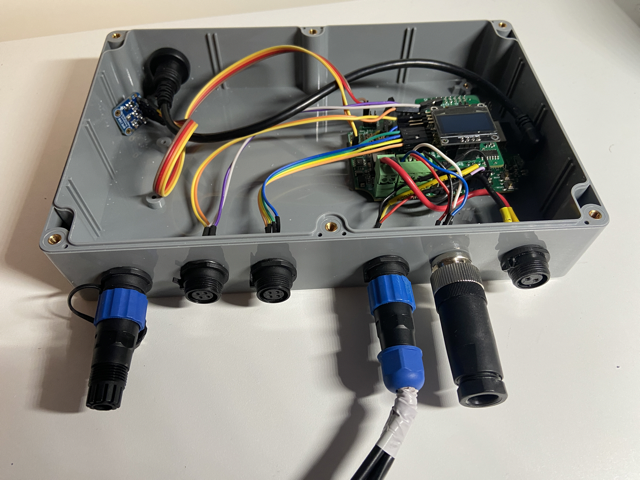

# SH-ESP32 Engine Hat for Volvo MD2020

This repository provides software for the [SH-ESP32 Engine Top Hat add-on board](https://hatlabs.fi/product/sh-esp32-engine-top-hat-kit/) to monitor engine and environmental data. It is based on the example code/firmware of the SH-ESP32 Engine Hat (based on SensESP, see [Getting Started](https://signalk.org/SensESP/pages/getting_started/) instructions).

This is what it looks like, it is connected to a Volvo Penta MD2020 engine:

## Mapping of sensors on SH-ESP32 and Engine Hat
Table below shows the connected sensors.

| Connector       | Sensor                                          | Pin       | jumper | Signalk path                                 | NMEA2000 PGN  |
| --------------- | ----------------------------------------------- | --------- | ------ | -------------------------------------------- | ------------- |
| Power           | 12V Power + | 12V+      | N/A    | N/A                                          |               |
| Power           | Ground         | GND       | N/A    | N/A                                          |               |
| CAN             | Connect [four wires](http://docs.hatlabs.fi/sh-esp32/pages/tutorials/nmea2000-gateway/)                                 | CAN-block | N/A    | N/A                                          |               |
| 1-wire #1       | Temp oil carter                                 | 1-wire #1 | N/A    | propulsion.1.oilTemperature                  | 127489        |
| 1-wire #1       | Temp engine room                                | 1-wire #1 | N/A    | environment.inside.engineRoom.temperature    |               |
| 1-wire #1       | Temp cabin                                      | 1-wire #1 | N/A    | environment.outside.temperature              | 130310        |
| EngineHat1      | Cooling water engine sender                                  | A1        | ja     | propulsion.1.temperature                     | 127489        |
| EngineHat1      | Cooling water engine alarm                                  | D1        | nee    | notifications.propulsion.1.overTemperature                                             |               |
| EngineHat1      | Oil pressure engine sender                                   | A2        | ja     | propulsion.1.oilPressure                     | 127489        |
| EngineHat1      | Oil pressure engine alarm                                   | D2        | nee    | notifications.propulsion.1.lowOilPressure                                             |               |
| EngineHat2      | Fuel tank sender                               | A3        | nee    | tanks.fuel.1.currentLevel en currentVolume   |               |
| EngineHat2      | RPM (W-terminal alternator)                                | D3        | ja     | propulsion.1.revolutions                     | 127489,127488 |
| EngineHat2      | NOT USED                                        | A4        | -      |                                              |               |
| EngineHat2      | NOT USED                                        | D4        | -      |                                              |               |
| 1-Wire #2       | Future: fridge                                  | 1-wire #2 | N/A    | environment.inside.refridgerator.temperature | 130312        |
| 1-wire #2       | Future: starter battery                         | 1-wire #2 | N/A    |                                              | 127508        |
| Internal BME280 | Temperature                                     | I2C       | N/A    | environment.inside.enginehat                 |               |
| Internal BME280 | Atmospheric Pressure                            | I2C       | N/A    | environment.outside.pressure                 | 130314        |
| Internal BME280 | Relative Humidity                               | I2C       | N/A    | environment.outside.relativeHumidity         | 130313        |

Explanation with this table:
* Connector: the connectors on the front from right to left
* Sensor: the connected sensor
* PIN: the pin (of other interface) where the sensor is connected to the SH-ESP32 or Engine Hat add-on board
* Jumper: if the jumper on the Engine Hat is enabled or not
* Signalk-path: the path where the sensor will be reporting into
* NMEA2000 PGN: the NMEA2000 PGN that is supported on Raymarine devices (should be mapped by signak-to-nmea2000 plugin)

Credits and thanks to [Hat Labs](https://github.com/hatlabs) and [SignalK](https://signalk.org/) community for such providing high quality hardware, software and support.

